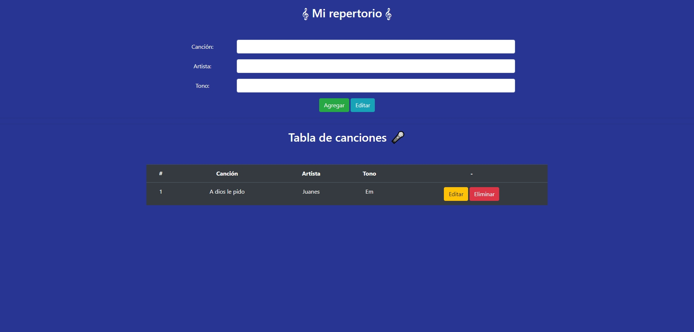
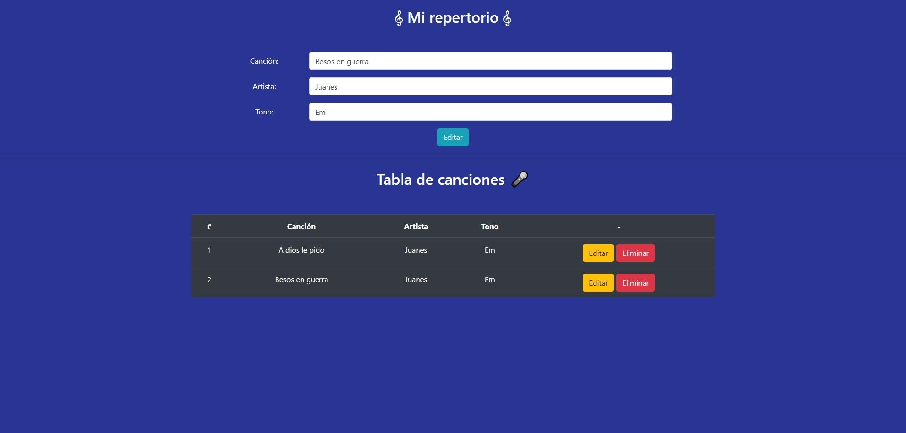
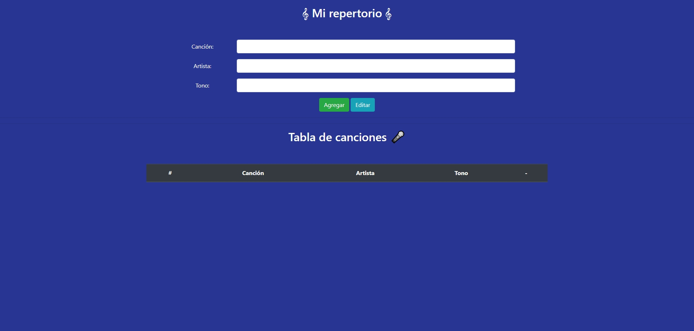

# Desafío evaluado - Mi repertorio

La escuela de música “E-Sueño” está motivando a sus estudiantes de canto a presentarse en
vivo y se puso en contacto con el restaurante del sector para usar su tarima e iniciar un
calendario de presentaciones. Para conocer y gestionar las canciones que cantarán sus
estudiantes, la escuela contrató a un desarrollador freelance para la creación de una
aplicación tipo CRUD.
En este desafío deberás desarrollar un servidor con Express que utilice el paquete pg para
conectarse con PostgreSQL y utilice funciones asíncronas para hacer las consultas a la base
de datos.

